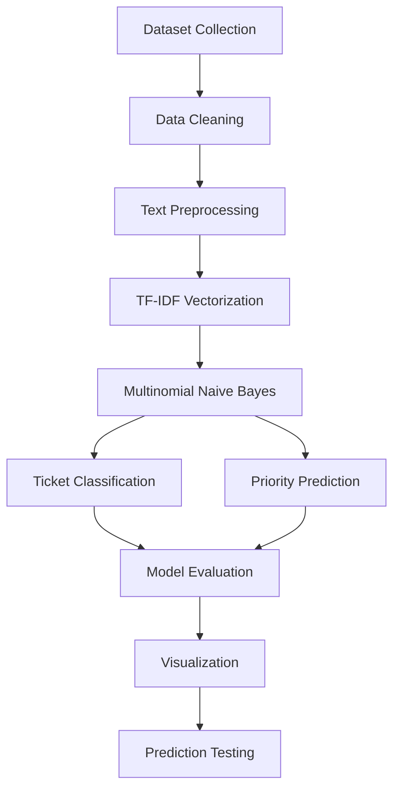

# 🎫 SUPPORT TICKET CLASSIFICATION & PRIORITIZATION


---

## 📌 PROJECT OVERVIEW

Customer support teams receive hundreds or even thousands of support tickets daily. Manually reviewing, categorizing, and prioritizing these tickets can be time-consuming and inefficient.

This project presents a **Machine Learning and Natural Language Processing (NLP)** based system that automatically analyzes customer support tickets, predicts their category, and assigns a priority level.

The system helps organizations:

✅ Improve support efficiency

✅ Reduce manual effort

✅ Speed up ticket routing

✅ Prioritize urgent customer issues

✅ Enhance customer satisfaction

---

## 📖 TABLE OF CONTENTS

- 📌 Project Overview
- ⚠️ Problem Statement
- 🎯 Objectives
- 📊 Dataset Information
- 🛠️ Technology Stack
- 🔄 Machine Learning Workflow
- 🧹 Data Preprocessing
- 🔍 Feature Engineering
- 🤖 Model Training
- 📂 Ticket Categories
- 🚦 Priority Levels
- ✨ Key Features
- 🔮 Sample Prediction
- 📈 Results & Evaluation
- 📊 Visualizations
- 📁 Project Structure
- 🚀 Installation
- ▶️ Usage
- 💼 Business Benefits
- 🔮 Future Enhancements
- 🏁 Conclusion
- 👩‍💻 Author

---

## ⚠️ PROBLEM STATEMENT

Modern organizations handle a massive volume of customer support requests every day.

Manual ticket management often leads to:

🔴 Delayed Response Times

🔴 Incorrect Ticket Routing

🔴 Difficulty Identifying Critical Issues

🔴 Increased Operational Costs

🔴 Lower Customer Satisfaction

To overcome these challenges, an intelligent automated ticket classification and prioritization system is required.

---

## 🎯 OBJECTIVES

🎯 Automatically classify support tickets into predefined categories.

🎯 Predict ticket priority levels (High, Medium, Low).

🎯 Reduce manual ticket sorting and routing efforts.

🎯 Improve support response times.

🎯 Enhance customer satisfaction through intelligent ticket management.

🎯 Provide insights through data visualization and analytics.

---

## 📊 DATASET INFORMATION

| Attribute | Details |
|------------|----------|
| 📄 Total Records | 8,469 |
| 📑 Total Columns | 17 |
| 🎯 Target Variables | Ticket Type, Ticket Priority |
| 📂 Dataset Type | Customer Support Tickets |

### 📋 Features Included

- 🆔 Ticket ID
- 👤 Customer Information
- 📦 Product Information
- 📝 Ticket Description
- 🏷️ Ticket Type
- 🚦 Ticket Priority

---

## 🛠️ TECHNOLOGY STACK

| Technology | Purpose |
|------------|----------|
| 🐍 Python | Core Programming Language |
| 🐼 Pandas | Data Processing |
| 🔢 NumPy | Numerical Computation |
| 🤖 Scikit-Learn | Machine Learning |
| 📊 Matplotlib | Data Visualization |
| 📓 Jupyter Notebook | Development Environment |
| 💬 NLP | Text Processing |

---

## 🔄 MACHINE LEARNING WORKFLOW



### Workflow Steps

📥 Data Collection

🧹 Data Cleaning

📝 Text Preprocessing

🔍 Feature Extraction using TF-IDF

🤖 Model Training

📂 Ticket Classification

🚦 Priority Prediction

📈 Model Evaluation

📊 Visualization

🔮 Prediction Testing

---

## 🧹 DATA PREPROCESSING

The ticket descriptions undergo multiple preprocessing steps:

✅ Missing Value Handling

✅ Text Cleaning

✅ Lowercase Conversion

✅ Stopword Removal

✅ Special Character Removal

✅ Text Normalization

These techniques improve the quality of textual data before model training.

---

## 🔍 FEATURE ENGINEERING

### TF-IDF Vectorization

TF-IDF (Term Frequency-Inverse Document Frequency) converts textual ticket descriptions into numerical features suitable for machine learning.

### Benefits

✔️ Captures important keywords

✔️ Reduces influence of common words

✔️ Improves classification accuracy

✔️ Efficient for large text datasets

---

## 🤖 MODEL TRAINING

### Classification Algorithm

🧠 Multinomial Naive Bayes

### Why Naive Bayes?

✅ Fast Training

✅ Fast Prediction

✅ High Accuracy for Text Classification

✅ Works Efficiently with TF-IDF Features

✅ Lightweight and Scalable

---

## 📂 TICKET CATEGORIES

The model classifies support tickets into the following categories:

💻 Technical Issue

💳 Billing Inquiry

📦 Product Inquiry

❌ Cancellation Request

🔄 Refund Request

---

## 🚦 PRIORITY LEVELS

🔴 High Priority

- Critical Issues
- Payment Failures
- Major System Outages

🟡 Medium Priority

- Functional Issues
- Configuration Problems
- Usage Difficulties

🟢 Low Priority

- General Questions
- Feedback
- Information Requests

---

## ✨ KEY FEATURES

✅ Automated Ticket Categorization

✅ Priority Prediction

✅ NLP-Based Text Processing

✅ TF-IDF Feature Extraction

✅ Machine Learning Classification

✅ Confusion Matrix Evaluation

✅ Ticket Analytics Visualization

✅ Real-Time Prediction Capability

✅ Easy-to-Use Workflow

✅ Business-Oriented Solution

---

## 🔮 SAMPLE PREDICTION

### 📝 Input Ticket

```text
Unable to login to my account after password reset
```

### 🎯 Predicted Output

```text
Category : Cancellation Request
Priority : Medium
```

---

## 📈 RESULTS & EVALUATION

### 📊 Evaluation Metrics

✅ Accuracy Score

✅ Confusion Matrix

✅ Classification Report

### 🏆 Model Performance

| Prediction Task | Accuracy |
|----------------|-----------|
| 📂 Ticket Classification | 86.4% |
| 🚦 Priority Prediction | 83.1% |

---

## 📊 VISUALIZATIONS

### 📈 Ticket Distribution

📷 Screenshot Placeholder

```text
assets/ticket_distribution.png
```

### 📉 Confusion Matrix

📷 Screenshot Placeholder

```text
assets/confusion_matrix.png
```

---

## 📁 PROJECT STRUCTURE

```text
SUPPORT-TICKET-CLASSIFICATION-PRIORITIZATION
│
├── 📂 data
│   └── customer_support_tickets.csv
│
├── 📂 notebooks
│   └── Support_Ticket_Classification.ipynb
│
├── 📂 models
│   ├── category_model.pkl
│   ├── priority_model.pkl
│   └── tfidf_vectorizer.pkl
│
├── 📂 assets
│   ├── confusion_matrix.png
│   └── ticket_distribution.png
│
├── requirements.txt
│
└── README.md
```

---

## 🚀 INSTALLATION

### 1️⃣ Clone Repository

```bash
git clone https://github.com/yourusername/SUPPORT-TICKET-CLASSIFICATION-PRIORITIZATION.git
```

### 2️⃣ Navigate to Project Folder

```bash
cd SUPPORT-TICKET-CLASSIFICATION-PRIORITIZATION
```

### 3️⃣ Install Dependencies

```bash
pip install -r requirements.txt
```

---

## ▶️ USAGE

### Launch Jupyter Notebook

```bash
jupyter notebook
```

Open:

```text
Support_Ticket_Classification.ipynb
```

Run all cells to:

✅ Load Dataset

✅ Preprocess Data

✅ Train Model

✅ Evaluate Performance

✅ Generate Predictions

---

## 💼 BUSINESS BENEFITS

⚡ Faster Ticket Routing

⚡ Improved Support Efficiency

⚡ Reduced Operational Costs

⚡ Better Resource Allocation

⚡ Faster Resolution of Critical Issues

⚡ Improved Customer Satisfaction

⚡ Data-Driven Decision Making

⚡ Increased Productivity

---

## 🔮 FUTURE ENHANCEMENTS

🚀 Deep Learning Models

🚀 BERT-Based Classification

🚀 Real-Time Web Application

🚀 Automated Ticket Assignment

🚀 Dashboard Integration

🚀 API Deployment

🚀 Multi-Language Support

🚀 Cloud Deployment

---

## 🏁 CONCLUSION

This project demonstrates the practical application of **Natural Language Processing (NLP)** and **Machine Learning** in customer support operations.

By automating ticket classification and prioritization, organizations can:

✅ Improve operational efficiency

✅ Reduce response times

✅ Optimize resource allocation

✅ Enhance customer satisfaction

This project serves as a real-world example of how Machine Learning can automate business workflows and improve decision-making.

---

## 👩‍💻 AUTHOR

### Devika S

---

### ⭐ If you found this project useful, don't forget to star the repository!
